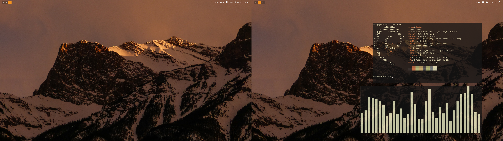

# debian-setup
My Debian 11 setup files
#### Note that these files are made for me so some files/scripts are assigned to my user name




## ISO download
https://cdimage.debian.org/cdimage/unofficial/non-free/cd-including-firmware/current/amd64/iso-cd/


## Setup Process

### Download
``
git clone https://github.com/arega24/debian-setup /home/arega/debian-setup/
``

### cd into the folder
``
cd ~/debian-setup
``

### Setup wm and install basic pacages
_Run as root_
``
./initial-setup-script.sh
``
### Copy files
Do NOT RUN as ROOT

_Exit root_
``
exit
``


_Run_
``
./copy-folders-script.sh
``

### The rest of .sh files
_Run as root_
``
su -
``

And execute the chosen file
``
./<file-name>.sh
``

### How to make a file executable
``
chmod u+x <file>
``

## Brave Browser
Srource: https://brave.com/linux/
### Comands
```
sudo apt install apt-transport-https curl

sudo curl -fsSLo /usr/share/keyrings/brave-browser-archive-keyring.gpg https://brave-browser-apt-release.s3.brave.com/brave-browser-archive-keyring.gpg

echo "deb [signed-by=/usr/share/keyrings/brave-browser-archive-keyring.gpg arch=amd64] https://brave-browser-apt-release.s3.brave.com/ stable main"|sudo tee /etc/apt/sources.list.d/brave-browser-release.list

sudo apt update

sudo apt install brave-browser

```

## NVIDIA
_source:_ https://wiki.debian.org/NvidiaGraphicsDrivers#nvidia-detect
#### You might want to run every comand individualy because it asks for some reboots
### Comands:
##### _Detect drivers and gpu_
``
nvidia-detect
``
_if no installed_
``
apt install nvidia-detect
``

#### _Rest of the comands_
kernel headers
``
apt install linux-headers-amd64
``

Descktop drivers v470.103.01
``
apt install nvidia-driver
``

Nvidia Tesla drivers
``
apt install nvidia-tesla-450-driver
``

Cuda
``
apt install nvidia-cuda-dev nvidia-cuda-toolkit
``


## Sudo do not recognise user on sudoers
```
su -
apt install sudo -y
adduser <username> sudo
chmod 0440 /etc/sudoers
exit
reboot
```

_After reboot run this test to see if it works_
``
sudo echo "Hello World"
``


## Snaps dont show up
### Run
```
sudo ln -s /var/lib/snapd/desktop/applications
/usr/share/applications/snapd
```


## Lightdm configuration
### Save last used user
_enter file:_
``
sudo vim /etc/lightdm/lightdm.conf
``

_enable and change line (line should look like this)_
``
greeter-hide-users=false
``

### Blackground slick greeter
_Run as root_

``
./lightdm-script.sh
``

#### Edit _/etc/lightdm/lightdm.conf as root_

_enable and change line (line should look like this)_

``
greeter-session=slick-greeter
``

## Folders missing
Just run
``
xdg-user-dirs-update
``
in the terminal

If accidentaly deleted run
``
xdg-user-dirs-update --force
``


## Auto mount Disck
### Make Folder Directory where the disck will be mounted
#### usualy it is on _/media/_ folder
``
sudo mkdir /media/Share
``

### Chose your disk
Run to list all your partitions
``
sudo fdisk -l
``

Run
``
sudo blkid
``
and copy the UUID from the selected disk

open fstab file

``
sudo vim /etc/fstab
``

Add the disk info (should something like this)
IMPORTANT NOTE: SEPERATE THE COMANDS WITH 1 TAB NOT SPACES
```
# Share Disk mount
UUID=161A21531A213163 /media/Share	ntfs	defaults	0	0
```


## Gamemode
### Steam
Go to game preferences -> General -> launch options 
and copy 
``
gamemoderun %command%
``

### Lutris
right click the game -> configure -> System Options -> Enable Gamemode

